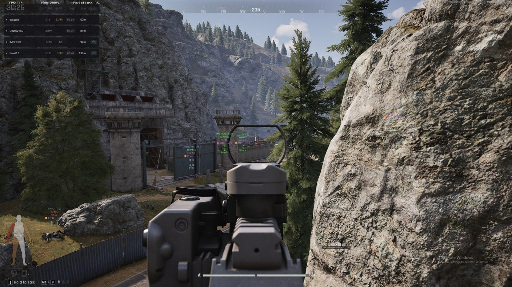
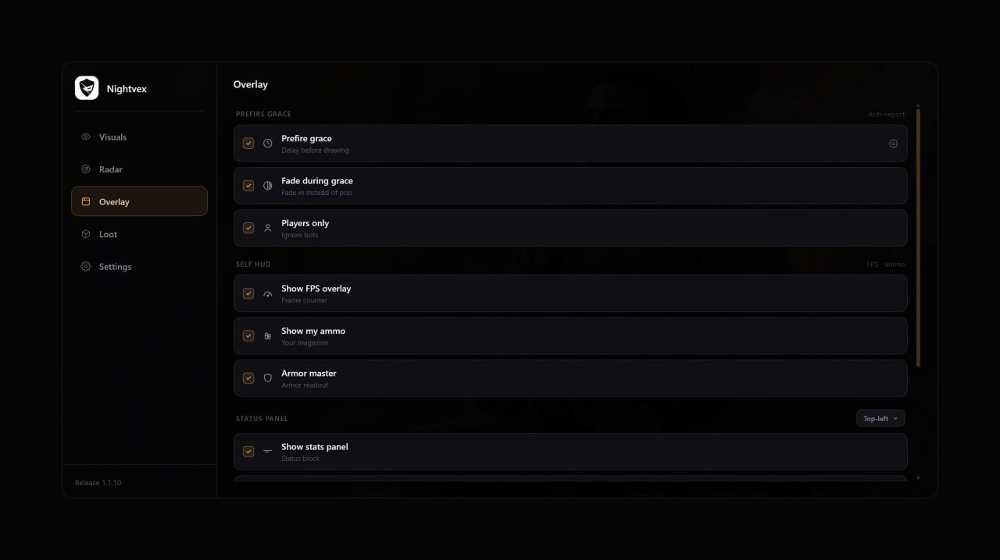
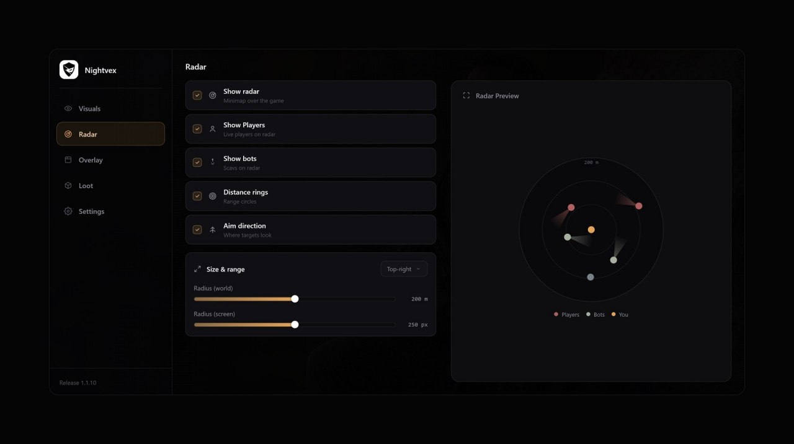
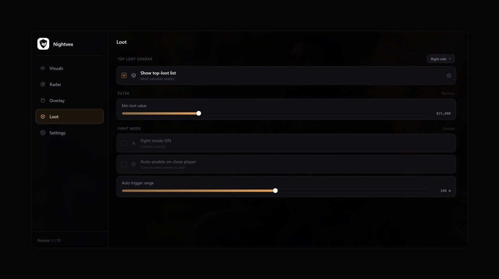
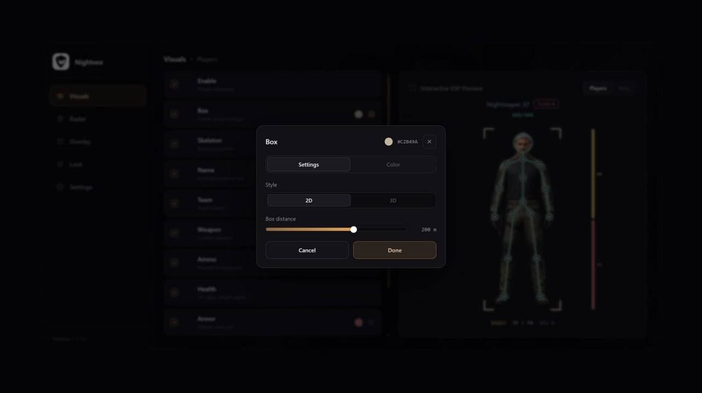
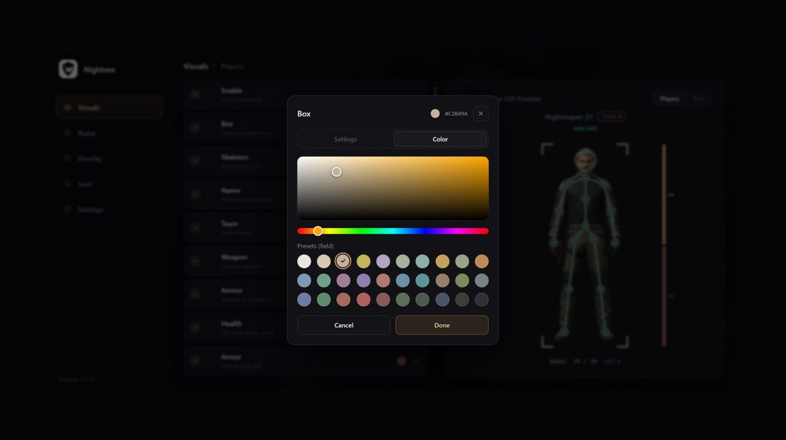
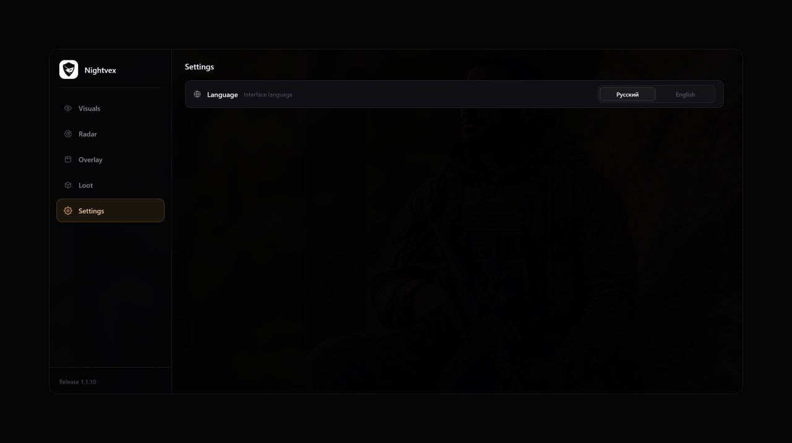
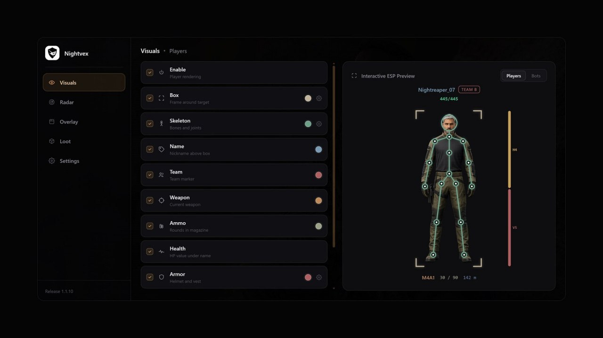

# Arena Breakout Infinite [ ☢ Nightvex ]

## 📸 Скриншоты

       

## 👤 Player ESP

* **Box Mode** – выбор отображения боксов: Off / 2D / 3D
* **Health** – отображение здоровья игроков
* **Boxes** – отображение боксов вокруг игроков
* **Weapon** – отображение оружия в руках
* **Skeleton** – отображение скелета игрока
* **Ammo** – отображение количества патронов
* **Name** – отображение имени игрока
* **Armor** – отображение брони
* **Armor Display** – выбор вида брони: Off / Text / Bar
* **Team ID** – отображение ID команды

## 📏 Distance ESP

* **Corpse** – отображение трупов
* **Teammates** – отображение союзников
* **Nearest Table** – таблица ближайших игроков
* **Corner Boxes** – отображение боксов в виде уголков

## 🤖 Bot ESP

* **Bot Box Mode** – выбор боксов для ботов: Off / 2D / 3D
* **Weapon** – отображение оружия ботов
* **Distance** – отображение расстояния до ботов
* **Bot Ammo** – отображение количества патронов
* **Bot Skeleton** – отображение скелета ботов
* **Bot Armor** – отображение брони ботов
* **Bot Corpse** – отображение трупов ботов
* **Bot Corner Boxes** – отображение боксов ботов в виде уголков

## 📡 Radar

* **Show Radar** – включение и отключение радара
* **Radar Range** – настройка дальности радара от 50 до 400 метров
* **Show Players** – отображение игроков на радаре
* **Show Bots** – отображение ботов на радаре
* **Radar Rings** – отображение кругов дальности
* **Aim Direction** – отображение направления прицела

## ⚔️ Fight Mode

* **Manual Toggle** – ручное включение и отключение боевого режима
* **Auto Mode** – автоматическое отключение режима, когда рядом находится враг
* **Auto Range** – настройка дистанции автоматического режима до 100 метров
* **ESP Colors** – настройка цвета боксов и других элементов

## 💰 Loot ESP

* **Top Loot Table** – таблица ценного лута, от 5 до 20 предметов
* **Minimum Loot Value** – минимальная стоимость отображаемого лута, от 25 000

## 🖥 Системные требования

* **Arena Breakout Infinite [ ☢ Nightvex ]:**
* ⚙️ **Операционная система:** Windows 10 - 11 ( 21H2 - 25H2)
* 🔲 **Процессор:** Intel / AMD
* 🔲 **Видеокарта:** Nvidia / AMD
* 🖥 **Режим игры:** Любой
* 🌐 **Поддерживаемые версии игры:** Arena Breakout Launcher / Steam / Epic Games
* 🤖 **Встроенный спуфер:** Нет
