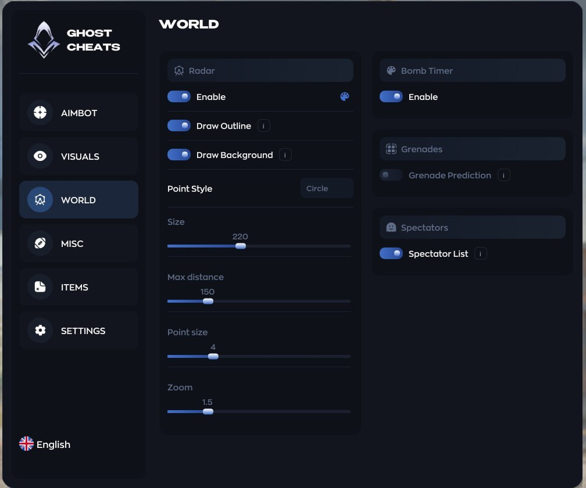
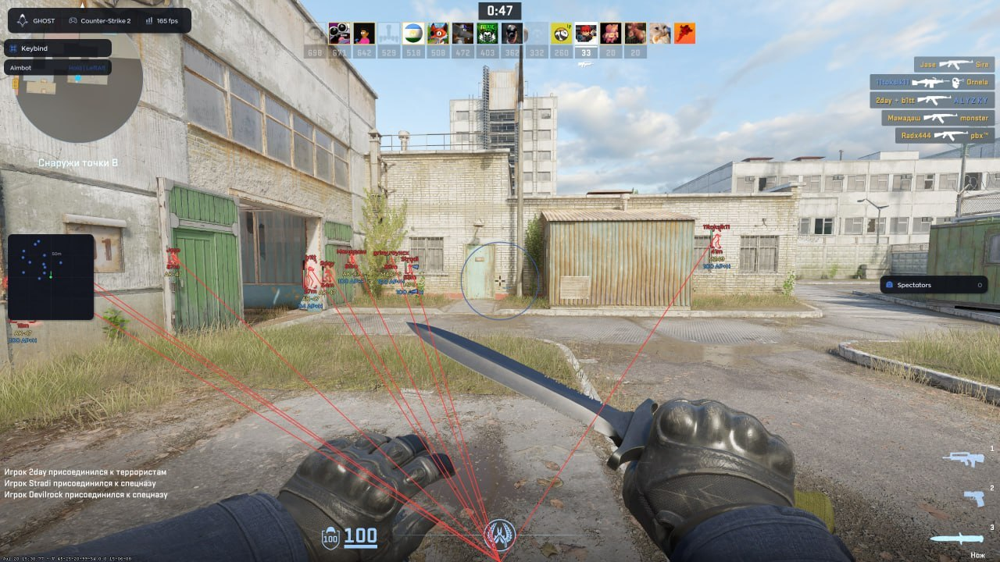

# Counter Strike 2 [ ☢ Ghost ]

## 📸 Скриншоты

.jpg) .jpg) .jpg) .jpg) .jpg)  

## 🎯 Aim

* **Aimbot** – основной режим автоматического наведения
* **Aim Key** – настройка собственной клавиши активации аима
* **Weapon Selection** – выбор оружия для работы аима
* **FOV** – настройка радиуса зоны наведения
* **FOV Color** – настройка цвета круга FOV
* **Smoothness** – настройка плавности наведения
* **Prediction** – компенсация движения цели и времени полёта пули
* **Target Priority** – выбор приоритета цели по прицелу или дистанции
* **Hitbox** – выбор зоны попадания: Head / Chest / Stomach / Nearest
* **Visibility Check** – наведение только на видимых противников
* **Smoke Check** – игнорирование целей за дымовой завесой
* **RCS** – автоматическая компенсация отдачи оружия
* **Humanizer** – имитация естественных движений мыши
* **Jitter** – добавление небольших случайных движений при наведении
* **Auto Body** – автоматическое переключение на тело при низком HP цели
* **Bone Mode** – выбор фиксированной или случайной зоны наведения
* **3D Preview** – интерактивное превью модели игрока и выбранных костей

## 👁 Aim Visuals

* **FOV Circle** – отображение круга FOV на экране
* **FOV Radius** – настройка размера круга FOV
* **FOV Color** – выбор цвета круга наведения
* **Target Preview** – отображение выбранной зоны наведения на 3D модели

## 👤 Player ESP

* **Enable** – включение и выключение Player ESP
* **Teammates** – отображение союзников
* **Visibility Check** – отображение только видимых игроков
* **Boxes** – отображение игроков в боксах
* **Visible Box Color** – отдельный цвет бокса видимого игрока
* **Invisible Box Color** – отдельный цвет бокса невидимого игрока
* **Skeleton** – отображение скелета игрока
* **Name** – отображение имени игрока
* **Glow** – подсветка модели игрока
* **Snapline** – линия от экрана до игрока
* **Distance** – отображение дистанции до игрока
* **Offscreen Arrows** – стрелки на игроков за пределами экрана
* **Health** – отображение здоровья игрока
* **Weapon** – отображение оружия в руках
* **Weapon Display** – выбор отображения оружия: Name / Icon
* **Armor & Helmet** – отображение брони и шлема
* **Money** – отображение количества денег
* **Rank** – отображение ранга игрока
* **Scoped** – отображение игрока, находящегося в прицеле
* **Flashed** – отображение ослеплённого игрока
* **Defuse Kit** – отображение наличия набора сапёра
* **Has Bomb** – отображение игрока с бомбой
* **Defusing** – отображение процесса разминирования
* **Reloading** – отображение процесса перезарядки
* **3D Preview** – интерактивное превью настроек Player ESP

## 🌍 Sense

* **Enable** – включение и выключение Sense
* **Sense Color** – настройка основного цвета Sense
* **Outline** – отображение контура Sense
* **Background** – отображение фона Sense
* **Point Style** – выбор формы точек: Circle / Square / Cross
* **Sense Size** – настройка размера Sense
* **Point Size** – настройка размера точек игроков
* **Max Distance** – настройка максимальной дистанции отображения
* **Scale** – настройка масштаба Sense

## 💣 World

* **Bomb Timer** – отображение обратного отсчёта до взрыва бомбы
* **Grenade Prediction** – отображение траектории полёта гранаты
* **Landing Point** – отображение предполагаемой точки приземления гранаты
* **Spectator List** – отображение списка игроков, наблюдающих за вами

## 🔧 Misc

* **Anti Flash** – отключение эффекта ослепления от световой гранаты
* **No Scope** – отключение стандартного оверлея снайперского прицела
* **Sense Hack** – отображение всех противников на игровом Sense
* **FOV Changer** – изменение игрового поля зрения
* **Adjustable FOV** – настройка значения FOV с помощью слайдера

## 🔫 Dropped Items

* **Enable** – включение отображения выброшенного оружия
* **Item Color** – настройка цвета отображаемых предметов
* **Display Mode** – выбор режима отображения: Name / Icon
* **Max Distance** – настройка максимальной дистанции отображения
* **Font Size** – настройка размера текста
* **Background** – включение фона под названием предмета
* **Ammo Count** – отображение оставшегося количества патронов
* **Weapon Filter** – выбор оружия для отображения
* **Weapon Search** – поиск оружия по названию
* **Weapon Support** – поддержка AK-47, AUG, AWP, FAMAS и другого оружия

## ⚙️ Settings

* **Config System** – система создания, удаления, сохранения и загрузки конфигов
* **Menu** – настройка внешнего вида меню
* **Watermark** – отображение логотипа продукта на экране
* **Keybind List** – отображение списка активных биндов
* **Stream Proof** – скрытие визуалов от OBS и записи экрана
* **Crosshair** – включение и настройка собственного прицела
* **Menu Key** – настройка клавиши открытия меню
* **DPI Scale** – настройка масштаба интерфейса
* **Language** – English / Русский

## 🖥 Системные требования

* **Counter Strike 2 [ ☢ Ghost ]:**
* ⚙️ **Операционная система:** Windows 10 | 11 (1903 - 25H2)
* 🔲 **Процессор:** INTEL | AMD
* 🔲 **Видеокарта:** Nvidia | AMD
* 🖥 **Режим игры:** Оконный | Безрамочный
* 🌐 **Поддерживаемые версии игры:** Steam
* 🤖 **Встроенный спуфер:** Нет
