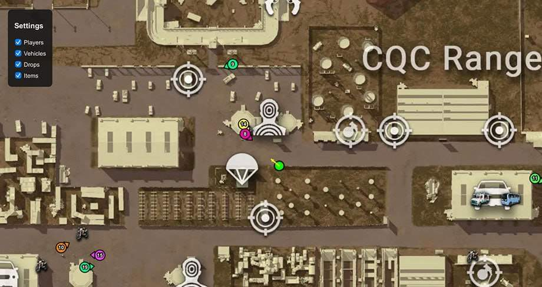
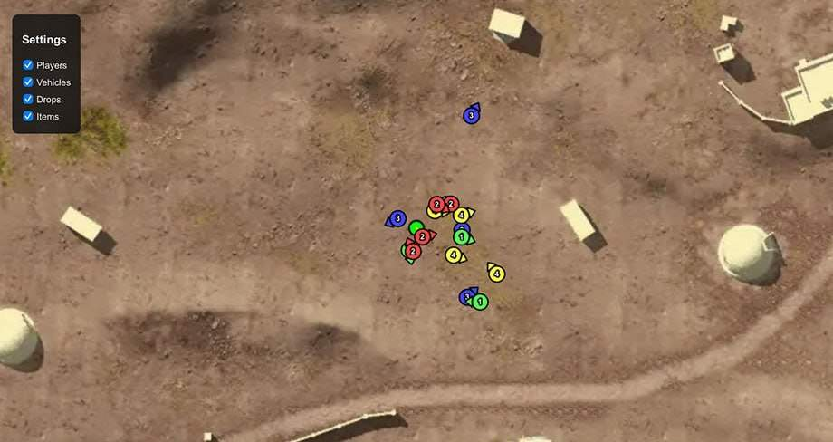
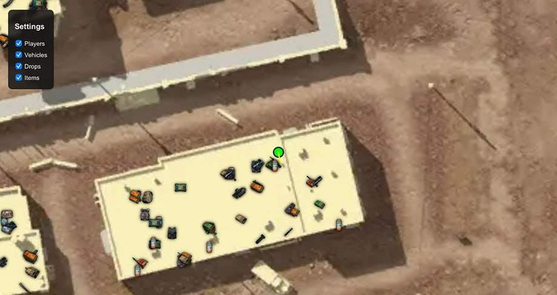
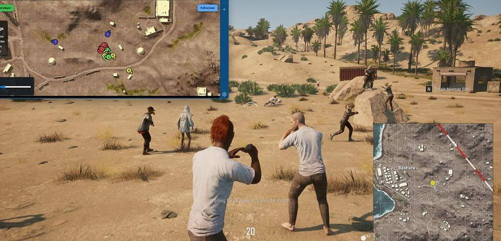
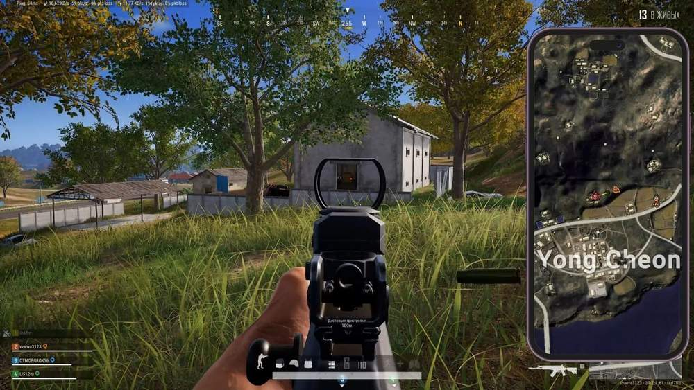
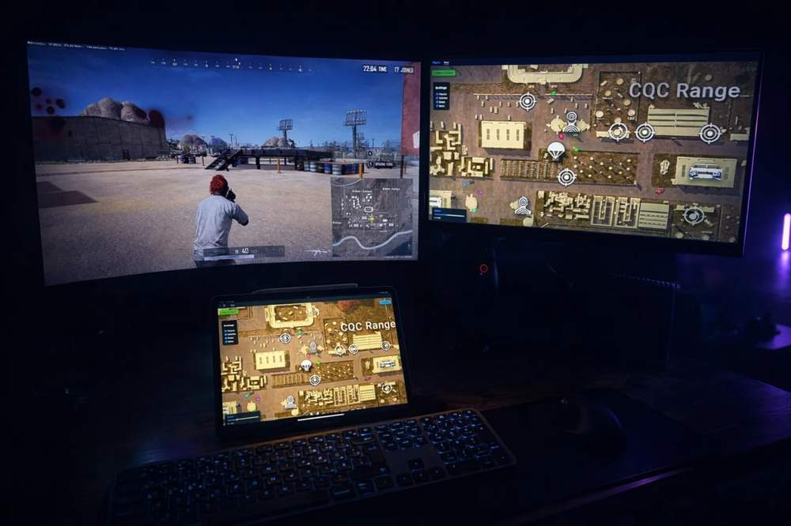

# Pubg [ ☢ Arcane Sense ]

## 📸 Скриншоты

     

* Функционал Pubg [ ☢ Arcane Sense ]:

## 📡 Sense

* **Any Device** – возможность открыть Sense на любом устройстве: втором мониторе, ноутбуке, планшете или смартфоне
* **Show Players** – отображение всех игроков на карте с обновлением их позиций в реальном времени
* **Show Vehicles** – отображение транспортных средств на карте
* **Show Drops** – отображение местоположения аирдропов
* **Show Items** – отображение предметов и лута на карте

## 👤 Player List

* **Team ID** – отображение номера команды игрока
* **Nickname** – отображение никнейма игрока
* **Weapon** – отображение оружия, находящегося в руках игрока
* **Ammo Count** – отображение текущего количества боеприпасов
* **Distance** – отображение расстояния до игрока
* ⚙️ Misc
* **Share Sense Link** – создание ссылки для передачи доступа к Sense другому пользователю
* **Browser Access** – открытие Sense напрямую через браузер
* **Second Monitor Support** – использование Sense на дополнительном мониторе
* **Mobile Access** – доступ к Sense со смартфона
* **Tablet Access** – доступ к Sense с планшета
* **Steam Overlay Support** – открытие Sense через Steam Overlay во время игры
* **Cross** – Device Access — использование Sense с любого устройства, подключённого к интернету

## 🖥 Системные требования

* **Pubg [ ☢ Arcane Sense ]:** 
* ⚙️ **️ Операционная система:** Windows 10 - 11 [21H2 / 22H2 / 23H2]
* 🔲 **Процессор:** Intel / AMD
* 🔲 **Видеокарта:** Nvidia / AMD
* 🖥 **Режим игры:** В окне без рамок / Оконный
* 🌐 **Поддерживаемые версии игры:** Steam, Kakao
* 🤖 **Встроенный спуфер:** Нет